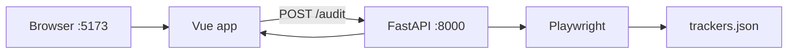

# Web Privacy Auditor

A full-stack portfolio project that audits any public URL for **third-party tags, known trackers, cookies, and scripts** — inspired by tag governance and privacy tools like **InfoTrust Tag Inspector**.

Enter a URL → get a **forensic-style report** of what the page loads in a real browser.

  

## Live demo (GCP Cloud Run)

| | URL |
|---|-----|
| **Web app** | https://privacy-web-869322756604.asia-south1.run.app/ |
| **API** | https://privacy-api-869322756604.asia-south1.run.app |
| **Health check** | https://privacy-api-869322756604.asia-south1.run.app/health |
| **OpenAPI docs** | https://privacy-api-869322756604.asia-south1.run.app/docs |

Deployed to **Google Cloud Run** (`asia-south1`) with Docker. First scan on a heavy site may take up to ~60 seconds while Playwright loads the page.

---

## Features

- **Browser-based scan** — Playwright (headless Chromium) loads the page like a real user
- **Known tracker detection** — explainable rules in `backend/app/rules/trackers.json` (27+ vendors)
- **Third-party network capture** — external domains, scripts, cookies
- **Categories** — Analytics, Advertising, Social, CDN, Unknown
- **“Why it matters”** — privacy notes per known tracker
- **Vue 3 dashboard** — summary chips, tabbed tables
- **REST API** — `POST /audit` with OpenAPI docs at `/docs`

---

## Tech stack

| Layer | Technology |
|-------|------------|
| Frontend | Vue 3, Vite |
| Backend | Python 3.12, FastAPI |
| Scanner | Playwright (sync, thread pool on Windows) |
| Rules | JSON vendor patterns |
| Deploy | Docker, Cloud Run (optional local via `docker compose`) |

---

## Architecture



---

## Prerequisites

- **Python 3.12** (`py -3.12`) — avoid 3.14 for Playwright/Pydantic compatibility
- **Node.js 18+** (`node -v`, `npm -v`)
- **Windows:** use sync `/audit` route (already configured) for reliable Chromium launch

---

## Quick start (Windows CMD)

### 1. Backend

```cmd
cd backend
py -3.12 -m venv .venv
.venv\Scripts\pip install -r requirements.txt
.venv\Scripts\playwright install chromium
.venv\Scripts\uvicorn.exe app.main:app --port 8000
```

- API: http://127.0.0.1:8000  
- Swagger: http://127.0.0.1:8000/docs  

### 2. Frontend (new CMD window)

```cmd
cd frontend
npm install
npm run dev
```

- UI: http://localhost:5173  

Vite proxies `/audit` and `/health` to the API (see `frontend/vite.config.js`).

### 3. Try it

1. Open http://localhost:5173  
2. Enter `https://edition.cnn.com/` (or any public URL)  
3. Click **Run audit** — wait 30–60 seconds for heavy sites  

---

## API

### `GET /health`

```json
{ "status": "ok" }
```

### `POST /audit`

**Request:**

```json
{ "url": "https://www.example.com" }
```

**Response (abbreviated):**

```json
{
  "url": "https://www.example.com",
  "duration_ms": 6000,
  "summary": [{ "category": "Analytics", "count": 2 }],
  "trackers": [{ "name": "Google Analytics", "category": "Analytics", "matched_url": "...", "why_it_matters": "..." }],
  "third_parties": [{ "domain": "...", "url": "...", "resource_type": "script" }],
  "cookies": [{ "name": "...", "domain": "..." }],
  "scripts": [{ "src": "...", "domain": "..." }],
  "notes": ["..."]
}
```

---

## Project structure

```
├── backend/
│   ├── app/
│   │   ├── main.py          # FastAPI routes
│   │   ├── scanner.py       # Playwright audit engine
│   │   ├── models.py        # Request/response schemas
│   │   └── rules/
│   │       └── trackers.json
│   └── requirements.txt
├── frontend/
│   ├── src/
│   │   ├── App.vue
│   │   ├── api.js
│   │   └── components/
│   │       └── AuditReport.vue
│   ├── package.json
│   └── vite.config.js
├── backend/Dockerfile
├── frontend/Dockerfile
├── docker-compose.yml
└── README.md
```

---

## Report tabs explained

| Tab | Meaning |
|-----|--------|
| **Trackers** | URLs matching **known vendors** in `trackers.json` + why it matters |
| **Third parties** | All external domains the page contacted |
| **Cookies** | Cookies set during the browser session |
| **Scripts** | Third-party `<script src="...">` tags |

---

## Relation to Tag Inspector (InfoTrust)

**Tag Inspector** is enterprise tag governance at scale. This project is a **focused MVP** in the same problem space: forensic visibility into tags, cookies, and third-party data flows for engineers and privacy reviewers.

---

## License

MIT — portfolio / educational use.
